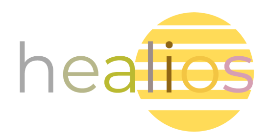
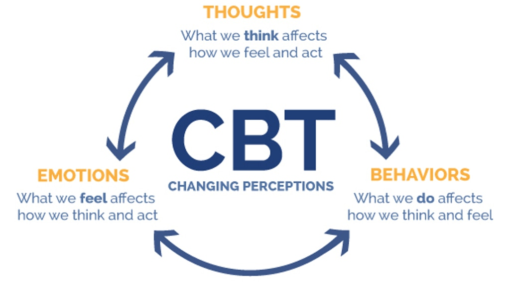
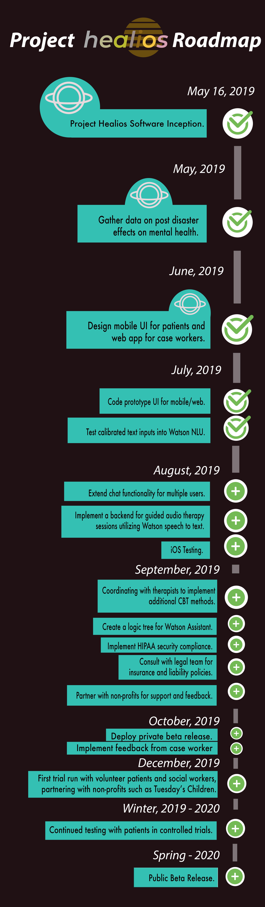

# Healios

## Call for Code 2019

## Overview

Healios streamlines the process for case workers to connect with survivors who may be coping with negative mental health symptoms. By leveraging the IBM Watson platform, Healios can provide high-quality mental health care at scale.
Casey, our chatbot, handles routine onboarding, information-gathering, and check-in tasks to give users a live experience at anytime, anywhere. A chatbot can handle much of the upfront load from new users, so caseworkers can focus on evaluating patients and providing counseling.

Our mobile application is compatible with iOS/Android and will be the public-facing UI for the platform. After registering, users can interact with the Casey chatbot, talk to their case worker, and complete CBT exercises based on their individual background and current situation. The exercises are conducted automatically, facilitated either by Casey or via a separate guided video/audio experience that can capture voice recordings of the user’s responses.

The caseworkers can then view their patients’ activity on a separate, web-based platform. Healios provides automatically generated reports using Watson that includes sentiment analysis of the patient’s chat history with Casey, and results from each CBT exercise they complete. These reports will help the case worker keep up-to-date with new and existing cases as efficiently as possible. Individual reports will also be compiled in a summary tab that track the patient’s overall change in emotional levels from week to week. Additionally, the interface is designed to keep relevant information accessible, while avoiding clutter: for example, the collapsible chat window is conveniently located on the side of the screen, allowing the caseworker to quickly respond to patients, and the homepage lists searchable patient records.

## Our Approach

We chose to implement a Cognitive Behavioral Therapy (CBT) based approach for our platform because studies show that CBT is currently the leading psychotherapy, and can be effective when conducted online for many conditions including PTSD, depression, anxiety, and panic disorders. Studies have also shown that CBT has effectively decreased symptoms of PTSD specifically in natural disaster survivors.

## Roadmap

Outlined below is our roadmap for the rest of 2019, into early 2020.

